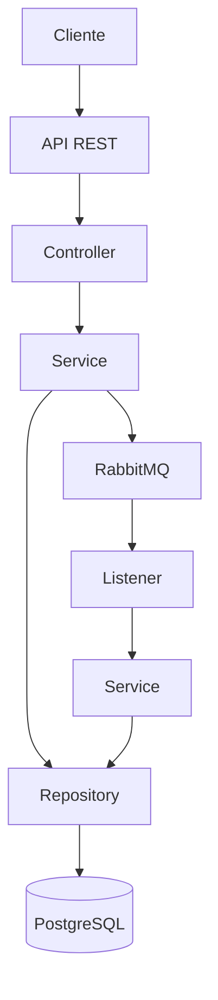

# Documentação do Projeto

## Visão Geral

Este projeto é um sistema de gerenciamento de pedidos desenvolvido em Java utilizando Spring Boot, RabbitMQ para a comunicação assíncrona de mensagens, e PostgreSQL como banco de dados relacional. O projeto foi totalmente configurado para rodar em um ambiente Docker, garantindo fácil replicação e implantação.

## Funcionalidades

O sistema oferece as seguintes funcionalidades:
1. **Listar todos os pedidos por cliente**: Permite obter uma lista de todos os pedidos feitos por um cliente específico.
2. **Retornar o número de pedidos feitos por um cliente**: Fornece a contagem total de pedidos realizados por um cliente.
3. **Retornar o valor de um pedido**: Calcula e retorna o valor total de um pedido específico.

## Arquitetura

### Diagrama de Comunicação



### Componentes Principais

1. **API REST (Spring Boot Controller)**: Ponto de entrada para as requisições HTTP.
2. **Service**: Contém a lógica de negócios e se comunica com os repositórios e RabbitMQ.
3. **Repository**: Interface para operações de banco de dados.
4. **RabbitMQ**: Sistema de mensageria para comunicação assíncrona.
5. **PostgreSQL**: Banco de dados relacional para armazenamento de dados.

## Configuração

### Docker

A aplicação utiliza Docker para configurar e rodar tanto o RabbitMQ quanto o PostgreSQL. Certifique-se de ter o Docker instalado em sua máquina.

### Docker Compose

```yaml
version: '3.1'

services:
  db:
    image: postgres:latest
    environment:
      POSTGRES_DB: btg_pactual
      POSTGRES_USER: btg_user
      POSTGRES_PASSWORD: btg_pass
    ports:
      - "5432:5432"
    volumes:
      - postgres_data:/var/lib/postgresql/data

  rabbitmq:
    image: rabbitmq:management
    ports:
      - "5672:5672"
      - "15672:15672"

volumes:
  postgres_data:
```

Para iniciar os serviços, execute:

```sh
docker-compose up
```

## Código Fonte

### Controller

```java
package com.br.jg.DesafioBTG.Controller;

import com.br.jg.DesafioBTG.Service.OrderService;
import org.springframework.beans.factory.annotation.Autowired;
import org.springframework.http.ResponseEntity;
import org.springframework.web.bind.annotation.GetMapping;
import org.springframework.web.bind.annotation.PathVariable;
import org.springframework.web.bind.annotation.RestController;

@RestController
public class OrderController {
    @Autowired
    private OrderService orderService;

    @GetMapping("/orders/{id}")
    public ResponseEntity getAllByClient(@PathVariable("id") Long codigoCliente){
        return orderService.getAllByClient(codigoCliente);
    }

    @GetMapping("/order-number/{id}")
    public ResponseEntity getNumberOfOrders(@PathVariable("id") Long codigoCliente){
        return orderService.getQuantityByClient(codigoCliente);
    }

    @GetMapping("/order-value/{id}")
    public ResponseEntity getValueOfOrder(@PathVariable("id") Long codigoPedido){
        return orderService.getTotalValue(codigoPedido);
    }
}
```

### Service

```java
package com.br.jg.DesafioBTG.Service;

import com.br.jg.DesafioBTG.Model.Order;
import com.br.jg.DesafioBTG.Repository.OrderRepository;
import org.springframework.beans.factory.annotation.Autowired;
import org.springframework.http.HttpStatus;
import org.springframework.http.ResponseEntity;
import org.springframework.stereotype.Service;
import org.springframework.web.server.ResponseStatusException;

@Service
public class OrderService {
    @Autowired
    private OrderRepository orderRepository;

    public ResponseEntity getAllByClient(Long codigoCliente){
        var orders = orderRepository.findAllByCodigoCliente(codigoCliente);
        if (orders.isEmpty()){
            throw new ResponseStatusException(HttpStatus.NO_CONTENT);
        }
        return ResponseEntity.status(HttpStatus.ACCEPTED).body(orders);
    }

    public ResponseEntity getQuantityByClient(Long codigoCliente){
        var orders = orderRepository.findAllByCodigoCliente(codigoCliente).size();
        if (orders == 0){
            throw new ResponseStatusException(HttpStatus.NO_CONTENT, "Não há pedidos para o cliente buscado.");
        }
        return ResponseEntity.status(HttpStatus.ACCEPTED).body("O cliente já fez um total de: " + orders + " pedidos" );
    }

    public ResponseEntity getTotalValue(Long codigoPedido){
        var order = orderRepository.findByCodigoPedido(codigoPedido);
        if (order.isEmpty()){
            throw new ResponseStatusException(HttpStatus.NO_CONTENT, "Não foi encontrado nenhum pedido");
        }
        return ResponseEntity.status(HttpStatus.ACCEPTED).body("O valor total da compra foi de: " + calcularTotalPedido(order.get()));
    }

    private String calcularTotalPedido(Order order){
        double valor = order.getItens().stream().mapToDouble(v -> v.getPreco() * v.getQuantidade()).sum();
        return String.format("%.2f", valor);
    }
}
```

### Listener

```java
package com.br.jg.DesafioBTG.Service;

import com.br.jg.DesafioBTG.Model.Order;
import com.br.jg.DesafioBTG.Repository.OrderRepository;
import com.br.jg.DesafioBTG.dto.OrderCreatedEvent;
import org.springframework.amqp.rabbit.annotation.RabbitListener;
import org.springframework.amqp.rabbit.core.RabbitTemplate;
import org.springframework.beans.factory.annotation.Autowired;
import org.springframework.stereotype.Service;

import static com.br.jg.DesafioBTG.config.RabbitMqConfig.ORDER_CREATED_QUEUE;

@Service
public class RabbitMQService {
    @Autowired
    private RabbitTemplate rabbitTemplate;
    @Autowired
    private OrderRepository orderRepository;

    public void sendOrder(OrderCreatedEvent orderCreatedEvent){
        rabbitTemplate.convertAndSend(ORDER_CREATED_QUEUE, orderCreatedEvent);
    }
    @RabbitListener(queues = ORDER_CREATED_QUEUE)
    public void receiveMessage(OrderCreatedEvent orderCreatedEvent){
        Order order = new Order(orderCreatedEvent.codigoPedido(), orderCreatedEvent.codigoCliente(), orderCreatedEvent.itens());
        orderRepository.save(order);
    }
    public void saveOrder(Order order){
        orderRepository.save(order);
    }
}

```

### Configuração do RabbitMQ

```java
package com.br.jg.DesafioBTG.config;

import org.springframework.amqp.core.Declarable;
import org.springframework.amqp.core.Queue;
import org.springframework.amqp.rabbit.core.RabbitTemplate;
import org.springframework.amqp.support.converter.Jackson2JsonMessageConverter;
import org.springframework.context.annotation.Bean;
import org.springframework.context.annotation.Configuration;

@Configuration
public class RabbitMqConfig {
    public static final String ORDER_CREATED_QUEUE = "btg-pactual-order-created";

    @Bean
    public Jackson2JsonMessageConverter jackson2JsonMessageConverter(){
        return new Jackson2JsonMessageConverter();
    }

    @Bean
    public Declarable orderCreatedQueue(){
        return new Queue(ORDER_CREATED_QUEUE);
    }
}
```

### Configuração do Aplicativo

Certifique-se de que suas propriedades de configuração no `application.properties` estão definidas corretamente para o PostgreSQL e RabbitMQ:


### Conclusão

Este projeto demonstra a integração de um sistema de pedidos utilizando Spring Boot, RabbitMQ e PostgreSQL, configurado para rodar em Docker. Ele implementa as funcionalidades necessárias para listar pedidos por cliente, contar o número de pedidos de um cliente e calcular o valor de um pedido, garantindo uma comunicação eficiente e assíncrona entre os componentes do sistema.
